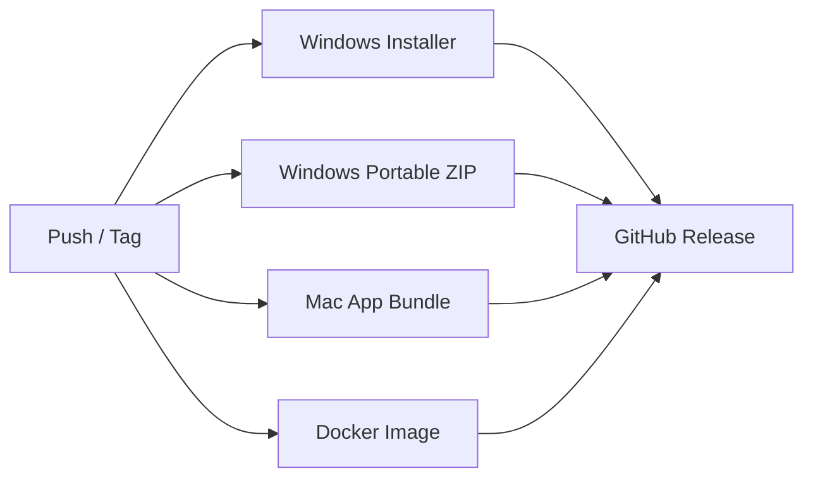

# Kodys CI/CD Pipeline – Build & Release Guide

## Overview

The GitHub Actions pipeline automatically builds the Kodys application for **all platforms** when code is pushed or a release tag is created.

### Supported Platforms

| Platform | Format | Use Case |
|----------|--------|----------|
| **Windows** | `.exe` installer | Desktop installation with shortcut |
| **Windows** | `.zip` portable | Extract and run, no admin needed |
| **Mac** | `.app` bundle | macOS desktop application |
| **Docker** | Container image | Server, cloud, **phone & tablet** via browser |

> **📱 Mobile & Tablet Support:** The Docker image serves the app as a web application accessible from any device with a browser — phones, tablets, laptops, and desktops.

---

## How It Works

```
Push to main/release → GitHub Actions → Build All Platforms → Upload Artifacts
Push a tag (v2.1.0)  → GitHub Actions → Build All → Create GitHub Release
```

### Pipeline Jobs



---

## Trigger the Pipeline

### Option 1: Push to Main Branch
```bash
git add .
git commit -m "Release v2.1.0"
git push origin main
```

### Option 2: Create a Release Tag
```bash
git tag v2.1.0
git push origin v2.1.0
# This triggers ALL builds + creates a GitHub Release with downloads
```

### Option 3: Manual Trigger (GitHub UI)
1. Go to **Actions** tab in your GitHub repo
2. Select **"Kodys Build & Release Pipeline"**
3. Click **"Run workflow"**
4. Choose options:
   - ✅ Build Windows installer
   - ✅ Build Mac package
   - ✅ Build Docker image
   - Enter version (e.g. `2.1.0`)

---

## Build Outputs

### Windows Installer (.exe)
- Built using **Inno Setup** from `installer_config.iss`
- Creates desktop shortcut
- Includes bundled Python 2.7.10 from `py-dist/`
- Output: `dist/Kodys Foot Clinik Installer.exe`

### Windows Portable ZIP
- Built using `package_for_client.py`
- Client extracts ZIP and runs `launchapp.bat`
- No installation required
- Output: `Kodys_Foot_Clinik_Package.zip`

### Mac Application (.app)
- Creates native macOS `.app` bundle
- Includes `Info.plist` with app metadata
- Launch script starts Django server + opens browser
- Output: `Kodys_Foot_Clinik_Mac_v2.x.x.zip`

### Docker Image (Web/Mobile/Tablet)
- Pushed to **GitHub Container Registry** (`ghcr.io`)
- Deploy on any server, clients access via browser from **any device**
- Output: `ghcr.io/<your-org>/kody/kodys:latest`

**Deploy for mobile/tablet access:**
```bash
# Pull the image
docker pull ghcr.io/<your-org>/kody/kodys:latest

# Run on your server
docker run -d -p 5423:5423 ghcr.io/<your-org>/kody/kodys:latest

# Access from any device:
# Phone:  http://YOUR_SERVER_IP:5423
# Tablet: http://YOUR_SERVER_IP:5423
# PC:     http://YOUR_SERVER_IP:5423
```

---

## Setup Requirements

### GitHub Repository Secrets

No additional secrets required — the pipeline uses `GITHUB_TOKEN` which is automatically provided.

### For Windows Installer Build
- The bundled Python 2.7.10 distribution in `py-dist/` must be committed to the repo
- `installer_config.iss` must be in the repo root
- `appicon.ico` must be in the repo root

### For Mac Build
- Python 2.7.18 is installed via `pyenv` during the build
- System dependencies are installed via Homebrew

### For Docker Build
- `Dockerfile` and `docker-compose.yml` are already in the repo

---

## Downloading Build Artifacts

### From GitHub Actions (every push)
1. Go to **Actions** tab
2. Click the latest workflow run
3. Scroll to **Artifacts** section
4. Download:
   - `windows-installer-2.0.0`
   - `windows-portable-2.0.0`
   - `mac-app-2.0.0`
   - `docker-image-2.0.0`

### From GitHub Releases (tags only)
1. Go to **Releases** page
2. Find the latest release
3. Download from the Assets section

---

## Pipeline File Location

```
.github/
  workflows/
    build-release.yml    ← Main CI/CD pipeline
```

---

## Troubleshooting

| Issue | Solution |
|-------|----------|
| Inno Setup not found | Pipeline installs it automatically |
| Python 2.7 build fails on Mac | Check `pyenv` installation in the logs |
| Docker build fails | Check `Dockerfile` for syntax errors |
| Artifacts not uploaded | Check file paths in `upload-artifact` step |
| Release not created | Ensure you pushed a tag starting with `v` |
